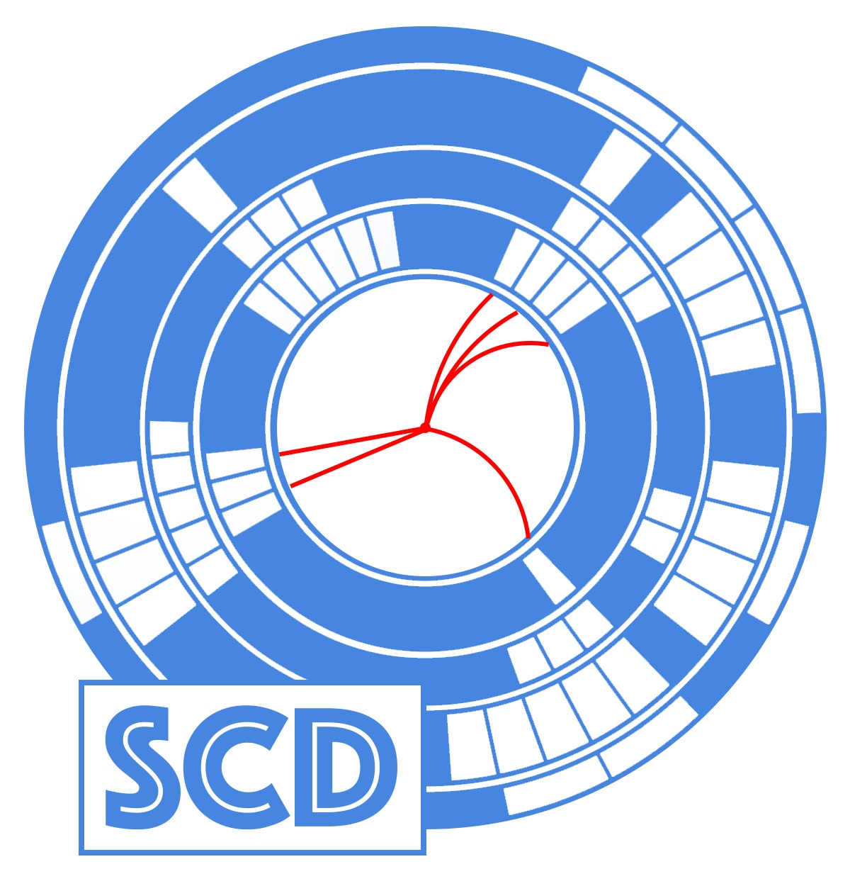

.. dig documentation master file, created by
   sphinx-quickstart on Thu Apr 15 09:25:32 2021.
   You can adapt this file completely to your liking, but it should at least
   contain the root `toctree` directive.
   
:github_url: https://github.com/scd-hep/scd-hep

SCD: Super Cool Detector Documentation
====================================

SCD: Super Cool Detector is a library for generating realistic detector data for doing research in machine learning.

.. toctree::
   :glob:
   :maxdepth: 1
   :caption: Get Started

   intro/introduction
   intro/installation
