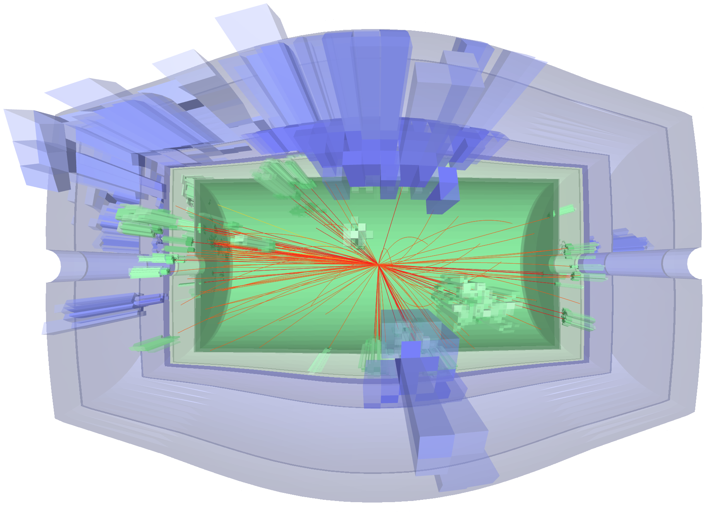

Introduction
======

The COnfigurable Calorimeter simulatiOn for Ai (COCOA) is a nearly-hermetic calorimeter 
simulated with `Geant4 <https://geant4.web.cern.ch/>`__ 
and interfaced to the `Pythia8 <https://www.pythia.org/>`__ event generator. 
This open-source simulation is aimed to support the development of machine learning algorithms 
in high energy physics that rely on realistic particle shower modeling, 
such as reconstruction, fast simulation, and low-level analysis.

The COCOA calorimeter comprises a barrel and endcap system with configurable granularity, 
and with nearly uniform material depth distribution in pseudorapidity. 
An inner tracker system consisting of silicon and iron layers immersed in a magnetic field 
can be included optionally, along with basic tracking emulation. 
Output data are processed using on-board algorithms for topological clustering of calorimeter cells, 
graph creation, and jet clustering. The COCOA geometry is also provided in a format 
supporting event visualization with `Phoenix <https://github.com/HSF/phoenix>`__.

